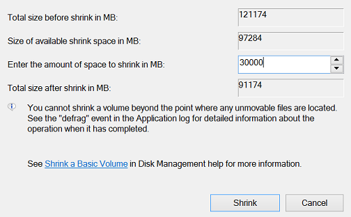

# UbuntuSurfaceBook
Setup of a Microsoft Surface Book to run Ubuntu!


# Initial Setup

## Dual boot with Ubuntu
### Shrink Windows partition
1. Press search button on your keyboard type partitions
2. Select Settings >> Create and format disk partitions
3. Select the Windows partition (C drive, yellow-marked) and shrink volume. The free space is for your Ubuntu installation 



### Starting Ubuntu from Live USB stick
1. Create a live usb stick with Ubuntu 18.04 (older versions after 17.04 do not support build-in keyboard OOTB on Surface Book), e.g. with [Unetbootin](https://unetbootin.github.io/)
2. Shutdown
3. Open Surface BIOS by pressing both Power and Volume_up
4. Change boot order by drag and drop, USB Storage as first entry 

5. Change secure boot settings to Secure boot is Enabled with Microsoft & 3rd party CA key configuration. (There is no need to completely disable secure boot) 
<span style="background-color:yellow"> **Note:** Try setting the value to enable with Microsoft and 3rd party. Once you update Linux's kernal you might not be able to start the OS unless you set the value to No secure boot</span>

6.Plugin the live USB stick and restart, Linux bootloader should come up automatically

### Install Ubuntu
1. Simply click on the Installer shortcut and follow the instructions
2. Download updates while installing ubuntu 

3. Select Installation type for your system
    - Choose Something else and click continue
    
    - In the next window we will see free available disk size
    
        - click it and click the + icon on the left of the install screen. We are going to create a swap area so that when our ram usage exceedes 100% we will still have the ability to open more programs. 
        - Specify the size value to be the same ammount of ram your computer has (in MegaBytes)
        - Select Primary for the Type for the new partition
        - Select Beginning of this space for the Location for the new partition. 
        - Select Swap area for the Use as menu
        - Click okay

    - Again 
        - click the free space partition and click the + icon on the left of the install screen. We are going to create a partition to install Ubuntu on.
        - Specify the size value to be your desired size of the Ubutnu operating system 
        - Select Primary for the Type for the new partition
        - Select Beginning of this space for the Location for the new partition. 
        - Select Ext4journaling file system for the Use as value
        - Select a single forward slash '/' for the mount point  
        - Click okay


    - Select the ubuntu partition as the Device for boot loader installation and then click Install Now
4. Continue Answering questions to finalize the instsallation process. 
5. Reboot

<br>
<hr>

## Further improvements:
### Touch and Pen
GitHub user jakeday created a [surface kernel](https://github.com/jakeday/linux-surface) where pen and touch is working. Thanks a lot!

<br>
<hr>

### Hibernation 
<span style="background-color:yellow"> **Note:** To Get Hibernation to work jakeday's solution wasn't working for me </span>

#### Here is what I did to make it work with Ubuntu 18.04:

1. Make your /swapfile have at least the size of your RAM

```
$ sudo swapoff /swapfile
$ sudo dd if=/dev/zero of=/swapfile bs=$(cat /proc/meminfo | grep MemTotal | grep -oh '[0-9]*') count=1024 conv=notrun
$ sudo mkswap /swapfile
$ sudo swapon /swapfile
```

2. Note the UUID of the partition containing your /swapfile:

```
$ sudo findmnt -no SOURCE,UUID -T /swapfile
Output: /dev/nvme0n1p5 20562a02-cfa6-42e0-bb9f-5e936ea763d0
```

3. Reconfigure the package uswsusp in order to correctly use the swapfile:

```
$ sudo dpkg-reconfigure -pmedium uswsusp

# Answer "Yes" to continue without swap space
# Select "/dev/disk/by-uuid/20562a02-cfa6-42e0-bb9f-5e936ea763d0" replace the UUID with the result from the previous findmnt command
# Encrypt: "No"
```

4. Edit the SystemD hibernate service using sudo systemctl edit systemd-hibernate.service and fill it with the following content:

```
[Service]
ExecStart=
ExecStartPre=-/bin/run-parts -v -a pre /lib/systemd/system-sleep
ExecStart=/usr/sbin/s2disk
ExecStartPost=-/bin/run-parts -v --reverse -a post /lib/systemd/system-sleep
```

5. Note the resume offset of your /swapfile:
```
$ sudo swap-offset /swapfile
Output: resume offset = 34818
```

6. Configure Grub to resume from the swapfile by editing /etc/default/grub and modify the following line:

```
GRUB_CMDLINE_LINUX_DEFAULT="resume=UUID=20562a02-cfa6-42e0-bb9f-5e936ea763d0 resume_offset=34818 quiet splash"
```

7. Update Grub:
```
$ sudo update-grub
```

8. Create the following /etc/initramfs-tools/conf.d/resume:
```
$ sudo nano /etc/initramfs-tools/conf.d/resume
```
Paste the following in the file, make sure you alter the values to your values.
```
RESUME=UUID=20562a02-cfa6-42e0-bb9e-5e936ea763d0 resume_offset=34816
# Resume from /swapfile
```

9. Update initramfs:

```
$ sudo update-initramfs -u -k all
```

10. Now you can hibernate with ```sudo systemctl hibernate.```

11. Turn on your computer via the power button

12. <span style="background-color:yellow"> **Note:** Note: This solution was working for a few days until it didn't. </span>

13. I then had to make a new script called hibernate 
```
$ sudo nano hibernate
```
Inside the file paste the following:
```
#!/bin/bash
sudo swapon /swapfile
sudo systemctl hibernate
```
 
14. Then make the script executable:
```
$ sudo chmod 700 hibernate
```

15. Now every time you want to put your computerin hibernation run this script. 

<br>
<hr>

#### Boot theme
The default boot theme in 3000x2000 is not optimal, here is an replacement:

[boot theme](https://github.com/timobaehr/Surface-Boot-Themes)


<br>
<hr>

What is not working out of the box
Currently not everything is working/unstable:
front and back camera
NVIDIA GPU
sleep/awake, use hibernate instead
touch and pen (if custom kernel is not used)
dock/undock of the screen (if custom kernel is used)
WiFi sometimes required a reboot to connect again after system configuration change

<br>
<hr>

## Resources 
[Install Ubuntu](https://askubuntu.com/questions/741851/using-ubuntu-on-microsoft-surface-book)

[Setting up hibernation](https://askubuntu.com/questions/6769/hibernate-and-resume-from-a-swap-file)